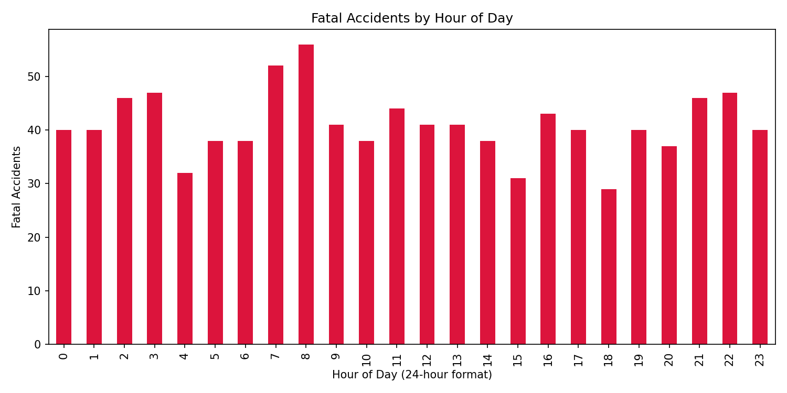
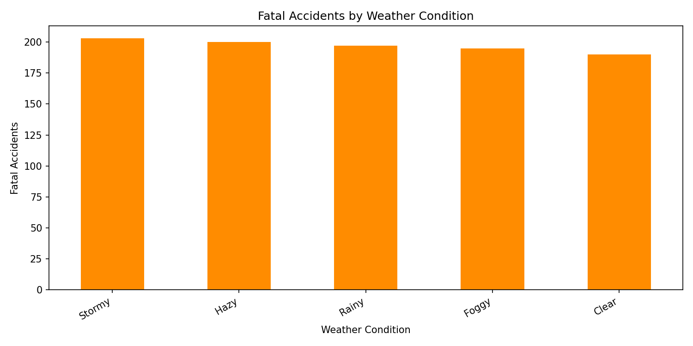
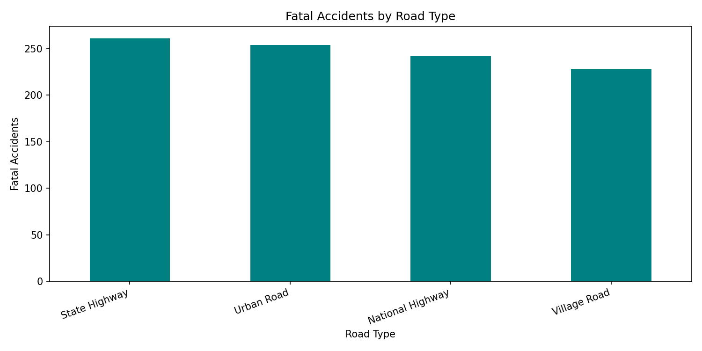
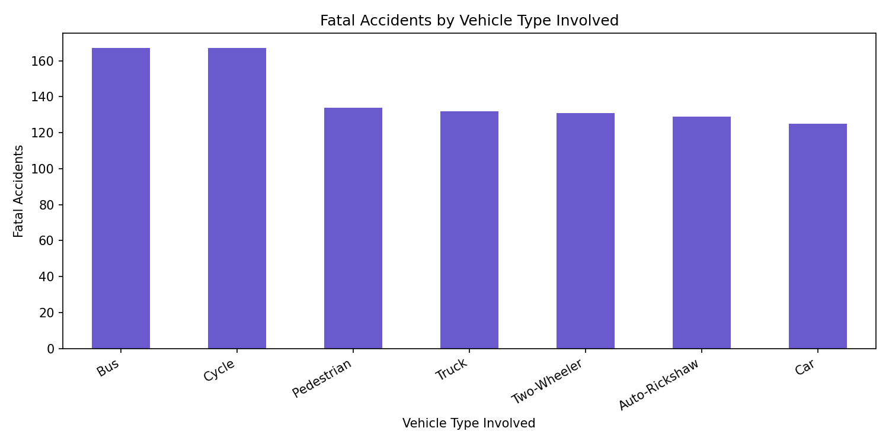
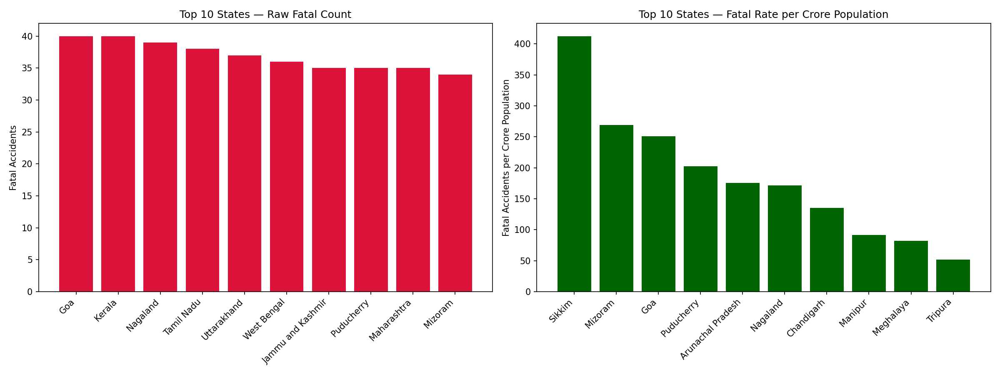
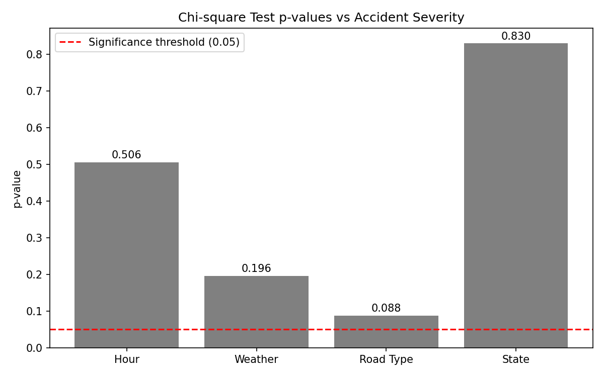

# 🚦 Road Accident Risk Analysis — India

Identifying high-risk time, weather, road, and location patterns in Indian road accidents using **SQL, Python, and R** — with statistical validation and population-normalized state comparisons.


---

## 📌 Project Overview

This project analyzes a 3,000-record Indian road accident dataset (2018–2023) to identify **when**, **where**, and **under what conditions** fatal accidents are most likely to occur — and, just as importantly, to check whether those patterns are *statistically real* rather than coincidence.

**Dataset:** [India Road Accident Dataset – Predictive Analysis (Kaggle)](https://www.kaggle.com/datasets/khushikyad001/india-road-accident-dataset-predictive-analysis)
**Records:** 3,000 · **Columns:** 22 · **Years:** 2018–2023

---

## 🗂️ Repository Structure

```
road-accident-analysis-india/
├── analysis.sql                          # SQL (SQLite) — aggregations & contingency tables
├── analysis.py                           # Python — reliability check, chi-square tests, charts
├── road_accident_analysis_v2.ipynb       # R notebook — statistical validation
├── road_accident_report.html             # Standalone HTML report
├── population_data.csv                   # State population reference (for normalization)
├── images/
│   ├── fatal_by_hour.png
│   ├── fatal_by_weather.png
│   ├── fatal_by_road_type.png
│   ├── fatal_by_vehicle_type.png
│   ├── fatal_by_state_raw_vs_normalized.png
│   └── chi_square_summary.png
└── README.md
```

---

## 🔍 Step 0 — Dataset Reliability Check

Before trusting any pattern, every categorical column was checked for uniformity. Real-world accident data is rarely evenly distributed — if every category has near-equal counts, that's a red flag for synthetic/randomly-generated data.

| Column | Min | Max | Ratio |
|---|---|---|---|
| Weather Conditions | 574 | 631 | 1.10 |
| Road Type | 712 | 771 | 1.08 |
| Day of Week | 402 | 468 | 1.16 |
| Month | 236 | 266 | 1.13 |
| Accident Severity | 981 | 1034 | 1.05 |
| Road Condition | 711 | 778 | 1.09 |
| Lighting Conditions | 725 | 763 | 1.05 |

Records per state ranged only **76–109**, despite real Indian state populations spanning a **340x** range (~7 lakh to ~24 crore). This mismatch suggests the dataset behaves like practice/synthetic data rather than real-world records — an important caveat carried through the rest of the analysis.

---

## 📊 Findings

### 1. Fatal Accidents by Hour of Day


Morning rush hour (7–8 AM) recorded the highest fatal accident counts — likely tied to peak commuter and school traffic volume, contrary to the assumption that late-night hours are riskiest.

### 2. Fatal Accidents by Weather Condition


Counts stay close across all weather types (190–203) — weather alone doesn't strongly separate fatal outcomes in this dataset.

### 3. Fatal Accidents by Road Type


State Highways recorded more fatal accidents than National Highways, despite typically lower speed limits — a possible signal of weaker safety infrastructure on state roads.

### 4. Fatal Accidents by Vehicle Type Involved


Cyclists and buses appear most frequently in fatal accidents. *Note: this column captures co-occurrence, not fault — it does not distinguish the causing vehicle from the victim's vehicle.*

### 5. State-wise Fatal Accidents — Raw Count vs. Population-Normalized Rate


| Raw Count (Top 5) | Rate per Crore Population (Top 5) |
|---|---|
| Goa, Kerala | Sikkim (412.5) |
| Nagaland | Mizoram (269.0) |
| Tamil Nadu | Goa (251.1) |
| Uttarakhand | Puducherry (202.1) |
| West Bengal | Arunachal Pradesh (175.7) |

This is the project's key insight: **raw counts and population-adjusted rates produce completely different state rankings.** Small states like Sikkim look negligible by raw count but rank highest once population is accounted for — showing why normalization matters before drawing policy conclusions.

### 6. Statistical Significance — Chi-Square Tests


| Factor | X² | df | p-value | Result |
|---|---|---|---|---|
| Hour | 45.19 | 46 | 0.506 | Not significant |
| Weather | 11.10 | 8 | 0.196 | Not significant |
| Road Type | 11.01 | 6 | 0.088 | Not significant |
| State | 51.38 | 62 | 0.830 | Not significant |

None of the four factors show a statistically significant relationship with Accident Severity (all p > 0.05). Combined with the uniformity findings in Step 0, this indicates the visual patterns above are **descriptive, not statistically confirmed** — an important distinction between "what the data shows" and "what the data proves."

---

## ✅ Key Takeaways

- Morning rush hour (7–8 AM) shows the highest raw fatal accident counts.
- Weather, road type, and state show no statistically significant relationship with severity (p > 0.05 across all chi-square tests).
- Population normalization completely changes the state risk ranking — raw counts alone are misleading.
- Dataset uniformity checks suggest this is likely synthetic/practice data, not verified real-world records — a caveat that should accompany any conclusion drawn from it.

---

## ⚠️ Limitations

- Dataset shows signs of synthetic generation (near-uniform category distributions, state record counts not proportional to real population).
- No statistically significant relationships were found between the tested factors and accident severity — findings should be read as exploratory patterns, not causal or confirmed effects.
- "Vehicle Type Involved" does not separate at-fault vehicle from victim vehicle.
- Population figures are 2025 estimates (Govt. of India Technical Group Population Projection Report 2011–2036, via StatisticsTimes.com) and are approximate.

---

## 🛠️ How to Run

**SQL:** Load `accident_prediction_india.csv` into a SQLite table named `accidents`, then run `analysis.sql`.

**Python:**
```bash
pip install pandas scipy matplotlib
python analysis.py
```

**R:** Open `road_accident_analysis_v2.ipynb` in Jupyter/Colab (R kernel) or RStudio and run all cells.

---

## 🧰 Tech Stack

- **SQL (SQLite)** — data aggregation, contingency tables
- **Python** (Pandas, Matplotlib, SciPy) — reliability checks, chi-square testing, chart generation
- **R** (base stats, `chisq.test`) — independent statistical validation
- **HTML/CSS** — standalone visual report

---

*Built by a 2nd-year Polytechnic EEE student as a self-driven data analysis portfolio project.*
